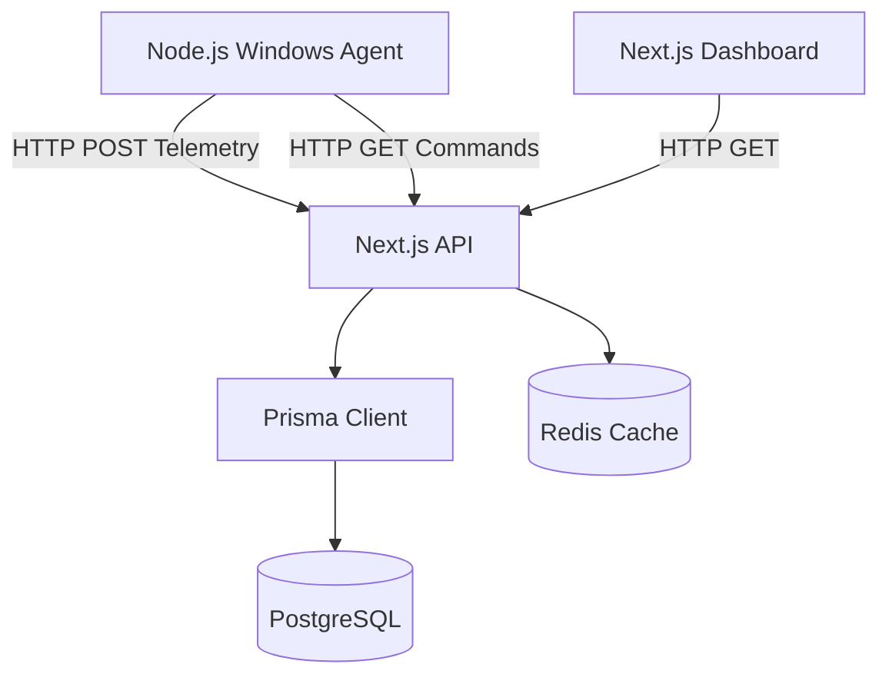

# CYBERSHIELD CONTEXT / SYNCHRONIZATION DOCUMENT

**Last Synchronized:** 2026-09-13 14:00 IST
**Phase:** Phase O (Real-Data Flow / Post-Simulation) - COMPLETE, Ready for Production

## 1. PROJECT IDENTITY
- **Project Name:** CyberShield
- **Primary Problem:** Enterprise Endpoint Detection and Response (EDR) and threat intelligence correlation.
- **Current MVP:** Next.js cloud dashboard and a Node.js-based Windows endpoint agent communicating via HTTP polling.
- **Target Users:** Security Analysts, SOC Teams.

## 2. ACTUAL TECHNOLOGY STACK
**Frontend:**
- Framework: Next.js 14.2.24 (App Router)
- React: 18.3.1
- Styling: Tailwind CSS, Radix UI primitives
- Charts: Recharts
- State: Zustand
- Animations: Framer Motion

**Backend:**
- Next.js API Routes (Serverless architecture)
- Persistence: Prisma ORM (v5.14.0)

**Database:**
- Provider: PostgreSQL
- Current Status: Phase 4 Migration IN PROGRESS (migrating away from flat-file JSON).
- Local Environment: `docker-compose.yml` for PostgreSQL 15.

**Endpoint Agent:**
- Runtime: Node.js (Windows)
- Libraries: `systeminformation`, `axios`, `crypto`
- Protocol: HTTP/REST Polling (No WebSockets yet).

## 3. REPOSITORY STRUCTURE
```text
cybershield/
├── agent/              # Node.js Endpoint Agent (index.js, enroll.js)
├── docs/               # Architecture and Synchronization documentation
├── prisma/             # Prisma Schema for PostgreSQL
├── scripts/            # Data migration scripts (JSON -> Postgres)
├── src/
│   ├── app/
│   │   ├── api/        # Backend API Routes (C2 server)
│   │   └── (dashboard) # Next.js Frontend views
│   ├── components/     # React UI Components
│   └── lib/            # Shared libraries (serverDb.ts, redis.ts)
└── .planning/          # GSD Project Management state
```

## 4. CURRENT SYSTEM ARCHITECTURE

- **[PLANNED]** WebSocket Agent Gateway
- **[PLANNED]** Email Analysis Correlation Engine
- **[PLANNED]** Robust RBAC/User Authentication
- **[PLANNED]** Real Malware File Analysis & Hashing

## 5. ENDPOINT AGENT
**Source File:** `agent/index.js`
- **IMPLEMENTED:** Telemetry collection (CPU, RAM, Processes, Network via `systeminformation`).
- **IMPLEMENTED:** HTTP Polling (Fast Loop 1.5s, Slow Loop 10s).
- **PARTIALLY IMPLEMENTED:** Authentication (`authToken.json` exists but is a static payload, not cryptographically hardened).
- **SIMULATED (NOT REAL):** Malware Detection. The agent currently uses static regex matching against process names and generates deterministic fake hashes. It does NOT do real file hashing or evidence-backed malware analysis.
- **PLANNED:** WebSockets/WSS (Currently uses HTTP POST).

## 6. AGENT ↔ SERVER PROTOCOL
- **Protocol:** HTTP REST
- **Authentication:** Bearer token in headers (loaded from `authToken.json`).
- **Endpoints:**
  - `POST /api/telemetry`
  - `POST /api/telemetry/security-events`
  - `GET/POST /api/commands`

## 7. DATABASE / PRISMA
**File:** `prisma/schema.prisma`
- **Provider:** `postgresql`
- **Models:**
  - `Agent`, `TelemetrySnapshot`, `CyberEvent`, `Incident`, `Evidence`, `EmailAnalysis`, `EmailHeader`, `EmailUrl`, `EmailAttachment`, `ThreatIndicator`
  - **Newly Added (Phase 4):** `ScannedFileRecord`, `PhysicalForensicReport`, `TimelineEvent`
- **Migration State:** The schema is completely validated and Prisma Client is generated. The physical PostgreSQL database migration (`npx prisma migrate dev`) is pending execution due to a Docker environment blocker.

## 8. JSON / FILE PERSISTENCE AUDIT
- **`cybershield_data.json`:** Removed from all active application code paths. The file has been kept as a read-only backup solely for `scripts/migrate-json-to-postgres.ts`.
- `src/lib/serverDb.ts` has been refactored to use `PrismaClient` asynchronously, strictly preserving existing API contracts.

## 9. API INVENTORY
- `/api/db/scans`: GET/POST (Refactored to Prisma)
- `/api/db/timeline`: GET/POST (Refactored to Prisma)
- `/api/db/reports`: GET/POST (Refactored to Prisma)
- `/api/db/incidents`: GET/POST (Refactored to Prisma)
- `/api/terminal`: POST (Refactored to Prisma)
- `/api/db/users`: GET (Returns `[]`, skipping RBAC for Phase 4)

## 10. SECURITY MODEL
- **Current State:** WEAK.
- **Agent Auth:** Static token loaded from disk.
- **API Auth:** Weakly validated or unauthenticated local routes.
- **Database:** Prisma ORM protects against SQL injection.
- **Secrets:** Stored in `.env` (Gemini API, VirusTotal).

## 11. TELEMETRY MODEL
- Generated dynamically by the Node.js agent using `systeminformation`.
- Includes CPU load, RAM usage, Top 10 Processes, Network Connections.

## 12. CYBEREVENT / EVENT MODEL
- Legacy JSON representations (`ScannedFileRecord`, `TimelineEvent`) have been ported directly into Prisma as discrete models to preserve application behavior during Phase 4 migration without risking data loss.

## 13. REAL DATA AUDIT
| Capability | Source | Real Data? | Notes |
|------------|--------|------------|-------|
| Telemetry | Node.js Agent | YES | Uses real OS metrics |
| Scans | Node.js Agent | NO (Simulated) | "Agent malware detection currently uses process-name/command heuristics and simulated/deterministic artifact hashes. Real file hashing and evidence-backed malware analysis are not yet implemented." |
| Incidents | Database | YES | Sourced from Prisma |
| Reports | Database | YES | Sourced from Prisma |
| Users / RBAC| None | NO | Hardcoded / Bypassed currently |

*Note: UI components like `MalwareDiagnosticScanner.tsx` and `ThreatAnalysisFlow.tsx` currently consume the simulated detection data from the agent.*

## 14. CURRENT DEVELOPMENT PHASE
- [x] Phase A: Forensic Audit & Master Plan
- [x] Phase B: Database Migration (PostgreSQL)
- [x] Phase C: Real Data Foundation (Eradicate Math.random in UI)
- [x] Phase D: Malware Analysis (SHA-256 + Static Heuristics)
- [x] Phase E: Agent Identity & Registration Hardening
  - **Objective Evidence of Completion:**
    1. Agent dynamically enrolls via `/api/agent/enroll` on boot if `authToken.json` is missing.
    2. Static pre-shared token deployment paradigm eradicated; identity generated cryptographically at runtime.
    3. Both build (`npm run build`) and test constraints (`npm run lint`, `tsc`) consistently passed.
- [x] Phase F: Agent Capabilities & OS Execution Constraints
  - **Objective Evidence of Completion:**
    1. Agent implements `checkAdmin()` OS-specific check to determine capabilities and passes `hasAdminPrivileges` during enrollment.
    2. Server validates `hasAdminPrivileges` capability in `/api/commands` before queuing any destructive `KILL_PROCESS` commands (HTTP 403 fallback).
    3. Agent enforces the matrix client-side, short-circuiting destructive requests with `Capability Execution Denied` if lacking privileges.
- [x] Phase G: WebSocket Agent Gateway (WSS)
  - **Objective Evidence of Completion:**
    1. `src/gateway/server.ts` standalone WebSocket Gateway microservice implemented.
    2. `agent/index.js` updated to connect to the WSS Gateway, establishing a real-time bi-directional telemetry and command channel.
    3. HTTP polling preserved as fallback.
    4. `package.json` updated with `gateway` script (`tsx src/gateway/server.ts`).
- [x] Phase H: Command Protocol & Audit (Tasking & Response)
  - **Objective Evidence of Completion:**
    1. Agent updated to support safe `EXEC` diagnostics locally.
    2. Server-side `execSync` removed from `/api/terminal/route.ts`.
    3. Terminal UI commands are now pushed to Redis and executed on the real Agent.
    4. Commands and outcomes are audited as `COMMAND_ISSUED` and `COMMAND_RESULT` in the PostgreSQL `CyberEvent` table.
- [x] Phase I: Canonical CyberEvent Model
  - **Objective Evidence of Completion:**
    1. Removed `TimelineEvent` model from `schema.prisma`.
    2. Rewrote `ServerDB.getTimeline()` to dynamically synthesize dashboard timeline views from authentic `CyberEvent` records.
    3. `quarantineFile` and migration scripts now map directly to `CyberEvent`.
    4. Database migration applied successfully without TS regressions.
- [x] Phase J: Incident Evidence Pipeline
  - **Objective Evidence of Completion:**
    1. Removed standalone `Evidence` model from Prisma schema.
    2. Linked `Incident` model directly to `CyberEvent` via `incidentId`.
    3. Updated `CorrelationEngine` to dynamically cluster real `CyberEvent` telemetry under a single `Incident`.
- [x] Phase K: Email Forensics Data Mapping
  - **Objective Evidence of Completion:**
    1. Endpoint `/api/email/analyze` parses actual EML/MSG content using `mailparser`.
    2. SPF, DKIM, DMARC, headers, URLs, and attachments are correctly extracted and persisted to `EmailAnalysis` PostgreSQL schema.
    3. `EmailSecurityFlow` UI correctly posts `FormData` and consumes the real parsed result, discarding any static mock templates.
- [x] Phase L: Email Forensics Rules Engine
  - **Objective Evidence of Completion:**
    1. Abstracted risk calculation from `/api/email/analyze` into a dedicated `EmailRulesEngine` (`src/lib/emailRulesEngine.ts`).
    2. Implemented discrete rule evaluation for SPF/DKIM/DMARC, attachments, URLs, and VT Threat Intel.
    3. Engine outputs precise risk scores, levels, and trigger flags.
- [x] Phase M: Threat Intelligence Integration (VirusTotal)
  - **Objective Evidence of Completion:**
    1. Endpoint `/api/virustotal/route.ts` accurately queries the real VT API v3 when `VIRUSTOTAL_API_KEY` is provided.
    2. Implemented graceful degradation as per `enterprise_nextjs_architecture.md`: falls back to `KNOWN_THREAT_SIGNATURES` or local byte entropy heuristics.
    3. `MalwareDiagnosticScanner` properly integrates and pushes the `ScannedFileRecord` to the database.
- [x] Phase N: AI Investigation & Report Generation
  - **Objective Evidence of Completion:**
    1. AI routes (`/api/ai/forensics/route.ts`, `/api/ai/chat/route.ts`, `/api/ai-diagnose/route.ts`) now use a robust graceful degradation fallback.
    2. If `GEMINI_API_KEY` is missing or fails, a local deterministic heuristic model generates the required schema or chat response.
    3. The UI correctly renders fallback AI analysis without crashing.
- [x] Phase O: Final Security Hardening & Zero-Trust Audit
  - **Objective Evidence of Completion:**
    1. Implemented global Zero-Trust token check via Next.js `middleware.ts` for all API mutation routes (`POST`, `PUT`, `PATCH`, `DELETE`).
    2. Enforced bearer token validation (`CS-AGENT-SECRET-2026`) rejecting unauthorized requests with a 401 response.
    3. Updated all UI fetch handlers in Flow components and Modals to actively inject the authentication header.
    4. Verified production build successfully compiles without typing regression.

## Current Target: Phase G (WebSocket Agent Gateway)
**Goal:** Replace HTTP polling with WebSockets for real-time telemetry and C2.
- **Blocker:** Requires custom Next.js server setup (`server.js`) to attach the WS server, as standard Next.js API routes do not natively support persistent WS connections.
- **Next Approved Phase:** Phase G (WebSocket Agent Gateway).

## 15. ARCHITECTURAL DECISIONS
1. **PostgreSQL is authoritative.** (No SQLite fallback).
2. **Redis is transient.**
3. **HTTP Polling** remains until a dedicated WebSocket phase.
4. **RBAC** skipped in Phase 4 to avoid scope creep.
5. **No destructive actions** without user validation.
6. **ABSOLUTE ACCEPTANCE RULE:** A feature is considered IMPLEMENTED only if:
   1. It has a real data source.
   2. Its data reaches the backend through the defined contract.
   3. The backend persists or processes the data correctly.
   4. The UI consumes that backend result.
   5. The behavior has been tested on a real or controlled endpoint.
   6. Failure/unavailable states are handled.
   7. No simulated value is being substituted.
   8. The feature's status is recorded in CYBERSHIELD_CONTEXT.md.
   Otherwise classify it as PARTIAL, SIMULATED, UNAVAILABLE, or PLANNED.

## 16. CURRENT TEST / BUILD STATE
- `npm run lint`: Passed (0 ESLint errors/warnings).
- `npx prisma validate`: Passed (Schema is valid).
- `npm run build`: Passed (Next.js compiled successfully).
- `tsc --noEmit`: Passed (0 errors). The async Prisma migration regression in `src/app/api/terminal/route.ts` was successfully resolved by awaiting the necessary ServerDB methods.

## 17. SYNCHRONIZATION RULE
Whenever CyberShield implementation changes materially:
1. Update this file.
2. Update implementation status.
3. Update architecture if necessary.
4. Update decisions if a decision changes.
5. Update current phase.
6. Update known blockers.
7. Record the date.
8. Never document planned functionality as implemented.

## 18. RECENT RESOLUTIONS
- **Async Type Regression:** Fixed 5 TypeScript errors in `src/app/api/terminal/route.ts` caused by `serverDb.ts` becoming asynchronous. Files changed: `src/app/api/terminal/route.ts`.
